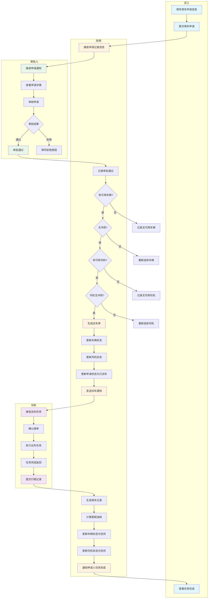

# 用车申请与调度管理泳道图

## 泳道说明

| 泳道 | 职责 | 主要活动 |
|------|------|----------|
| **员工** | 发起用车需求 | 填写申请、提交申请、查看完成 |
| **审批人** | 审核用车申请 | 接收通知、查看详情、审批决策 |
| **系统** | 自动调度管理 | 接收申请、自动派车、状态更新、生成记录 |
| **司机** | 执行派车任务 | 接单、出车、完成任务、提交记录 |

## 流程要点

1. **申请提交**：员工填写并提交用车申请
2. **审批决策**：审批人审核并决定通过或拒绝
3. **自动派车**：系统自动匹配可用车辆和司机
4. **任务执行**：司机接收任务并执行
5. **归档完成**：系统生成记录并通知申请人