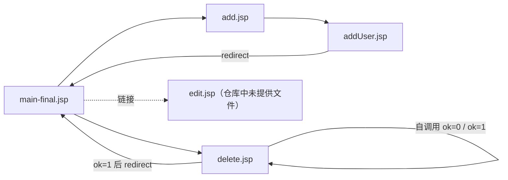

# student_teacher_jsp_jdbc

传统 **JSP + JDBC** 的 Java Web 示例项目（Eclipse Dynamic Web Project 风格）。

---

## 项目结构

| 位置 | 说明 |
|------|------|
| `src/main/webapp/*.jsp` | 全部 JSP 页面；业务与 JDBC 主要写在 JSP 脚本（scriptlet）中 |
| `src/main/webapp/WEB-INF/lib/` | 应用依赖的 JAR，随 WAR 部署时由容器加载到 **Web 应用** 的类路径 |
| `src/main/webapp/WEB-INF/lib/h2-1.4.182.jar` | **H2 数据库 JDBC 驱动**，供 JSP 中 `Class.forName("org.h2.Driver")` 等代码使用；一般无需再复制到 Tomcat 全局 `lib` |
| `src/main/java/` | `.classpath` 中声明的 Java 源码目录（当前仓库中可无 `.java` 文件） |
| `.classpath` / `.project` / `.settings/` | Eclipse 工程与 Facet 配置（如 Tomcat 10、Java 17、Web） |
| `build/classes`（配置中的输出目录） | Java 编译输出 |

**关于 `WEB-INF`：** 当前目录下除 `lib` 外**未包含** `web.xml`。在 Servlet 3.0+ 下可以零配置部署，JSP 仍由容器按默认规则映射访问。

---

## JSP 调用关系说明

以下分析**刻意忽略**演示用页面 `main.jsp`、`main-jdbc.jsp`，只描述与 **JDBC 主流程**相关的页面。

### 参与页面

- **`main-final.jsp`**：列表入口；内联 JDBC 查询 `user` 表并渲染表格。
- **`add.jsp`**：新增用户表单页。
- **`addUser.jsp`**：接收表单参数，执行 `INSERT`，完成后 `response.sendRedirect("main-final.jsp")`。
- **`delete.jsp`**：根据参数 `ok` 区分「确认删除展示」与「执行删除」；删除完成后 `sendRedirect("main-final.jsp")`。

### 调用关系图

### 要点摘要

1. **`main-final.jsp`** 链向 `add.jsp`，表格每行链向 `edit.jsp?...` 与 `delete.jsp?action=2&id=...&ok=0`。
2. **`add.jsp`** 表单 `action="addUser.jsp"`，`method="get"`。
3. **`delete.jsp`**：`ok=0` 时查库并展示确认；确认链接为 `delete.jsp?action=1&id=...&ok=1`。表单 `action="delete.jsp"` 未写 `method` 时默认为 **GET**。
4. **数据库配置**：上述 JDBC 页面使用 H2，连接串示例为 `jdbc:h2:d:/temp/test`，用户 `sa`、空密码；需与本机 H2 数据文件路径一致。
5. **`edit.jsp` 缺口**：`main-final.jsp` 中「修改」链接指向 **`edit.jsp`**，但当前仓库中**没有**该文件，直接访问会得到 404（除非你在其他位置另行提供同名页面）。

---

## 简要说明（实现与扩展）

- **分层**：增删查写在 JSP 内，便于教学；生产环境通常拆到 Servlet / JavaBean / DAO。
- **安全提示**：`delete.jsp` 等处若用字符串拼接 SQL，存在 **SQL 注入**风险；练习熟悉流程后，建议改用 **PreparedStatement** 并做好参数校验。
- **扩展建议**：补全编辑功能时可新增 `edit.jsp`（展示）与更新页（执行 `UPDATE` 后 `redirect` 回 `main-final.jsp`），与现有新增、删除模式保持一致。
